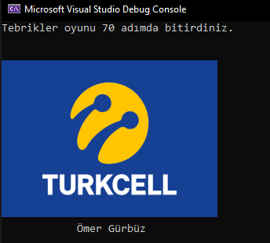

# Color Blast Oyunu

Turkcell Geleceği Yazanlar Programı Ödevi

Oyun, uygun renkteki sayıya basarak siyah kareye komşu olan tüm o renkleri de siyaha çevirerek haritayı tek renge boyama oyunudur. Bir bakıma sol üstteki siyah karenin yayılma temeline dayanıyor. Oyun nesneye yönelik programlama esaslarına göre yazıldı.

Son güncelleme ile Windows'a ait, Drawing kütüphanesi ve kernel32.dll kütüphanesi dahil edilmiştir. Bu kütüphaneler aracılığıyla konsol üzerinde resim gösterilebilmektedir. Cihazınızda herhangi bir hata ile karşılaşmanız durumunda bir önceki sürümü kullanabilirsiniz.

Örnek bir oyun içi görünümü

Devam eden oyunun görünümü

Oyun sonu görünümü

